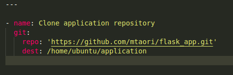
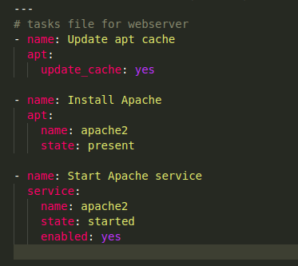
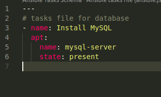
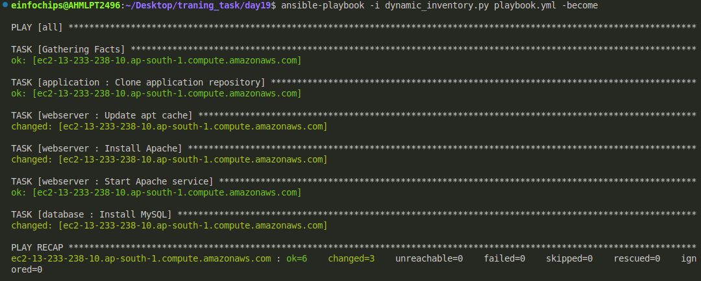

## To achive the following task milestone:

Step 1: Create the 3 roles named as application, database, webserver

+ application/task/main.yaml:

  
+ In this step I have creted the simple flask app and push it into github repository and in this playbook, I have fetch the flask app form by git repository.

Step 2:

+ webserver/task/main.yaml




Step 3:

+ go to roles: database/tasks/main.yaml



Step 4:

+ create an ansible.cfg and define you dynamic inventory path like this:

```
[defaults]
innventory=/path/to/your/inventory
```

Step 5:

+ Create the dynamic inventory file:

```py
#!/usr/bin/env python3

import json
import boto3

def get_inventory():
    ec2 = boto3.client('ec2', region_name='ap-south-1')  # Specify your region
    response = ec2.describe_instances(Filters=[{'Name': 'tag:Name', 'Values': ['Manan']}])
  
    inventory = {
        'all': {
            'hosts': [],
            'vars': {}
        },
        '_meta': {
            'hostvars': {}
        }
    }
  
    ssh_key_file = '/home/einfochips/Downloads/ansiblekey.pem'  # Path to your SSH private key file
    ssh_user = 'ubuntu'  # SSH username
  
    for reservation in response['Reservations']:
        for instance in reservation['Instances']:
            public_dns = instance.get('PublicDnsName', instance['InstanceId'])
            inventory['all']['hosts'].append(public_dns)
            inventory['_meta']['hostvars'][public_dns] = {
                'ansible_host': instance.get('PublicIpAddress', instance['InstanceId']),
                'ansible_ssh_private_key_file': ssh_key_file,
                'ansible_user': ssh_user
            }

    return inventory

if __name__ == '__main__':
    print(json.dumps(get_inventory()))
```

Step 6:

+ Create a playbook.yml file:
  ```
  - hosts: all
    roles:
      - application
      - webserver
      - database

  ```

Step 7: Now run this playbook.yaml file by this command

Node : before running the playbook check weather ping is working or not by this command:

```
ansible -m ping all

```

Now run the playbook:

```
ansible-playbook -i dynamic_inventory.py playbook.yaml
```



Here is the directory structure:

```bash
.
├── ansible.cfg
├── application
│   ├── defaults
│   │   └── main.yml
│   ├── files
│   ├── handlers
│   │   └── main.yml
│   ├── meta
│   │   └── main.yml
│   ├── README.md
│   ├── tasks
│   │   └── main.yml
│   ├── templates
│   ├── tests
│   │   ├── inventory
│   │   └── test.yml
│   └── vars
│       └── main.yml
├── database
│   ├── defaults
│   │   └── main.yml
│   ├── files
│   ├── handlers
│   │   └── main.yml
│   ├── meta
│   │   └── main.yml
│   ├── README.md
│   ├── tasks
│   │   └── main.yml
│   ├── templates
│   ├── tests
│   │   ├── inventory
│   │   └── test.yml
│   └── vars
│       └── main.yml
├── dynamic_inventory.py
├── images
│   └── Readme
│       ├── 1723010847855.png
│       ├── 1723010919473.png
│       ├── 1723011103028.png
│       └── 1723011827823.png
├── playbook.yml****
├── Readme.md
└── webserver
├── defaults
│   └── main.yml
├── files
├── handlers
│   └── main.yml
├── meta
│   └── main.yml
├── README.md
├── tasks
│   └── main.yml
├── templates
├── tests
│   ├── inventory
│   └── test.yml
└── vars
└── main.yml
```
